  

  Backend by day, frontend by taste, scripts in between. 
  I like systems that explain themselves: clear boundaries, numbers you can trust, tooling that stays out of the way.

 

## Menu

| | Stack | How I like it |
|:--|:--|:--|
| ☕ **Espresso** | Java, Spring, Gradle | Small services with clean seams. Domain first, framework second. |
| 🍯 **Pour-over** | JavaScript, TypeScript, Node | Readable over clever. Types where they pay for themselves. |
| 🐍 **House blend** | Python | Automation, data plumbing, crawlers that survive a bad connection. |
| 🧾 **On the side** | SQL, Docker, CI | Honest metrics, reproducible builds, logs a human can read. |

 

## On the counter

 
 

## Receipt

  
  

 

  The kettle is always on. Open an issue, leave a note, or just say hi.

