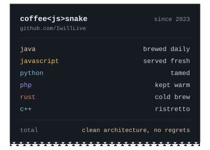

  

  Backend by day, frontend by taste, scripts in between. 
  I like systems that explain themselves: clear boundaries, numbers you can trust, tooling that stays out of the way.

 

## Menu

| | Stack | How I like it |
|:--|:--|:--|
| ☕ **Espresso** | Java, Spring, Gradle | Small services with clean seams. Domain first, framework second. |
| 🍯 **Pour-over** | JavaScript, TypeScript, Node | Readable over clever. Types where they pay for themselves. |
| 🐍 **House blend** | Python | Automation, data plumbing, crawlers that survive a bad connection. |
| 🥐 **Filter** | PHP | Legacy kitchens welcome. Refactor first, never rewrite on a Friday. |
| 🧊 **Cold brew** | Rust | For the parts that must be fast and cannot be wrong. |
| ⚙️ **Ristretto** | C++ | Short, strong, close to the metal. |
| 🧾 **On the side** | SQL, Docker, CI | Honest metrics, reproducible builds, logs a human can read. |

 

## On the counter

Today's special: **[IwillLiveDev](https://github.com/IwillLive/IwillLiveDev)**, the workbench where most of the above gets brewed.

 

## Receipt

 

  The kettle is always on. Open an issue, leave a note, or just say hi.

